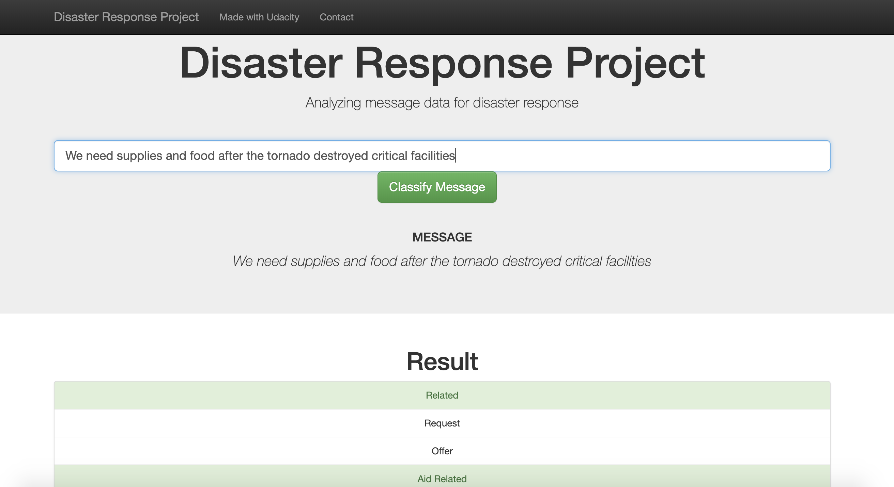

# Tweet Aggression Project

## Project Description

Utilizing and analyzing a dataset of classified Tweets from [Dataturks through Kaggle](https://www.kaggle.com/dataturks/dataset-for-detection-of-cybertrolls) to build a model that classifies Tweets between good or bad and display results in a Flask web application.

## Application File Layout

    .
    ├── app     
    │   ├── run.py                           # Flask file that runs app
    │   └── templates   
    │       ├── go.html                      # Classification result page of web app
    │       └── master.html                  # Main page of web app    
    ├── data                   
    │   ├── tweets.json                      # JSON Dataset with all the tweets  
    │   ├── tweet_train.csv                  # CSV Train Dataset with additional tweets
    │   ├── tweet_test.csv                   # CSV Test Dataset with additional tweets
    │   ├── process_data.py                  # Data cleaning
    │   └── TweetSentiment.db                # Database for Tweet Sentiment data
    ├── models
    │   ├── train_classifier.py              # Train ML model      
    │   └── classifier.pkl                   # Pickle file of model     
    ├── README.md
    ├── Data Analysis.ipynb
    └── requirements.txt

## Instructions (Skip steps 2 and 3 if .pkl file and .db database exists):
1. Run the following command to install necessary libraries.
    `pip install -r requirements.txt`

2. Run the following commands in the project's root directory to create the database and model.

    - To run ETL pipeline that cleans data and stores in database
        `python data/process_data.py data/tweet_train.csv data/TweetSentiment.db`
    - To run ML pipeline that trains classifier and saves
        `python models/train_classifier.py data/TweetSentiment.db models/classifier.pkl`

3. Run the following command in the app's directory to run the web app.
    `python run.py`

4. Go to http://0.0.0.0:33507/

## Example
Type in: 
```
Don't come over here, we hate you #loser
```
and click `Classify Tweet`


