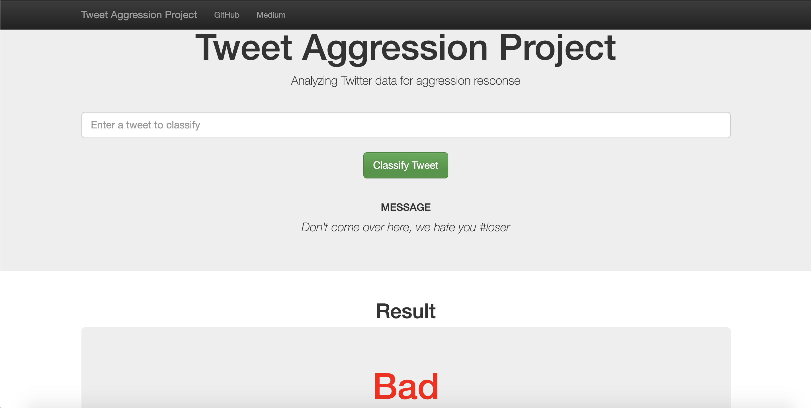

# Tweet Aggression Project

## Project Overview

Bullying has evolved to cyberbullying through the medium of the Internet and online social networks, and with the power of the Internet, online bullies can be illusive and more direct. According to [i-SAFE]( https://auth.isafe.org/outreach/media/media_cyber_bullying
), 42% of kids have been bullied while online, and 58% have not told their parents or an adult about something mean or hurtful that happened to them online. With machine learning, programmers are able to create solutions that can detect cyberbullying to a certain degree.

In this project, I created a Python Flask web application that classifies a tweet (including hashtags) between good or bad. The model is trained on a dataset of classified Tweets from [Dataturks through Kaggle](https://www.kaggle.com/dataturks/dataset-for-detection-of-cybertrolls) and utilizes the combination of Bag of Words and TF-IDF to focus on the frequency of individual words. 

## Web Link
https://twitter-aggression.herokuapp.com/

## Application File Layout

    .
    ├── app
    │   ├── __init__.py                      # Flask file that runs app
    │   ├── views.py                         # Flask file that contains endpoints
    │   ├── data
    │   │   └── TweetSentiment.db            # Database for Tweet Sentiment data
    │   ├── models
    │   │   └── classifier.pkl               # Pickle file of model  
    │   └── templates   
    │       ├── go.html                      # Classification result page of web app
    │       └── master.html                  # Main page of web app    
    ├── setup                   
    │   ├── tweets.json                      # JSON Dataset with all the tweets  
    │   ├── tweet_train.csv                  # CSV Train Dataset with additional tweets
    │   ├── tweet_test.csv                   # CSV Test Dataset with additional tweets
    │   ├── functions.py                     # Tokenize function
    │   ├── train_classifier.py              # Train ML model
    │   └── process_data.py                  # Data cleaning
    ├── models
    │   ├── train_classifier.py              # Train ML model      
    │   └── classifier.pkl                   # Pickle file of model  
    ├── imgs   
    ├── README.md
    ├── Report.ipynb                         # Project Report
    ├── Procfile                             # Specifies commands executed on startup
    ├── run.py                               # Entry point for the application
    └── requirements.txt                     # List of libraries to be installed

## Instructions (Skip steps 2 and 3 if .pkl file and .db database exists):
1. Run the following command to install necessary libraries.
    `pip install -r requirements.txt`

2. Run the following commands in the project's root directory to create the database and model.

    - To run ETL pipeline that cleans data and stores in database
        `python setup/process_data.py setup/tweet_train.csv app/data/TweetSentiment.db`
    - To run ML pipeline that trains classifier and saves
        `python setup/train_classifier.py app/data/TweetSentiment.db app/models/classifier.pkl`

3. Run the following command in the app's directory to run the web app.
    `gunicorn run:app`

4. Go to http://127.0.0.1:8000

## Example
Type in: 
```
Don't come over here, we hate you #loser
```
and click `Classify Tweet`




## Summary
The combination of Bag of Words, TF-IDF, and Random Forest yielded a good accuracy score of 91%, and after implementing GridSearchCV. Despite the high accuracy, there are two problems:
1. Skewed Data
2. Overfitting

The divide of data between good and bad is great, but after seeing that 'hate' and other bad words are shared between classified bad and good, the data is still skewed. At the end of Anaylsis in the report, the model was tested with a sentence with clear bad sentiment, but because of the skewed data (and other factors), the model predicted that the sentence has 'good' sentiment.

Also, the model was overfitting shown with the learning curve graph in the report. This may be due to a lack of complexity in the dataset. Two solutions are to add more data with more complexity and to tune the model's parameters.